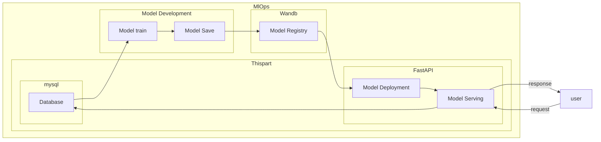

## MLOps 실습

네이버 영화 리뷰에 대한 긍부정을 판단하는 모델을 훈련하고 fastapi로 호스팅 하는 부분

- mysql과 fastapi간의 통신이 없지만 통합 구현에서 fastapi결과를 저장할 예정
- 모든 mlops 구현은 MLOps 폴더에서 따로 구현중

```mermaid
flowchart LR
    subgraph mysql
    Database
    end
    Database-->train[Model train]

    subgraph Model[Model Development]
    train-->save[Model Save]
    end

    subgraph FastAPI
    deployment[Model Deployment] -->serve[Model Serving]
    end

    user --request--> serve --response--> user

    subgraph Wandb
    save-->registry[Model Registry]-->deployment
    end

    serve --> Database

    subgraph Thispart
    FastAPI
    mysql
    end
    subgraph MlOps
    Thispart
    Wandb
    Model
    end
```
